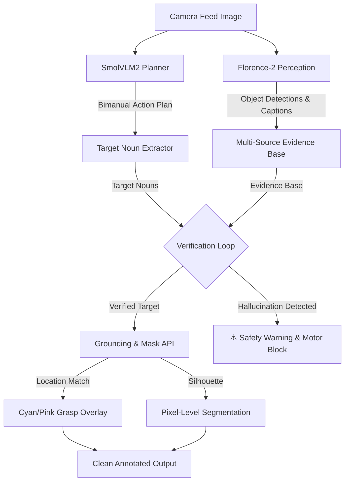

# 🤖 Nexus-XLe: Bimanual VLM Robotics Perception & Planning Pipeline

Nexus-XLe is a **Zero-Shot Generalization Framework** for closed-loop bimanual robotic planning and perception, designed for the **XLeRobot** platform (dual 6-DoF SO-101 robot arms). 

Rather than training low-level policy networks on thousands of hours of object-specific demonstrations, Nexus-XLe leverages pre-trained multi-modal foundation models to perform generalizable, training-free bimanual manipulation. By combining the zero-shot reasoning of **SmolVLM2** (planning) with the open-vocabulary spatial precision of **Florence-2** (fine-grained perception), it translates high-level natural language instructions into safe, visually-grounded, coordinate-precise bimanual actions for arbitrary unseen objects.

---

## 🌟 Key Features

* **🧠 Bimanual Action Planner**: Translates natural language commands (e.g., *"Grasp the wooden block and place it on the left side of the red cup"*) into structured, coordinated step-by-step instructions for `LEFT ARM`, `RIGHT ARM`, and `BOTH ARMS`.
* **🛡️ Closed-Loop Verification Loop**: Protects the robot from dangerous hallucinations. It extracts target nouns from the plan and cross-references them against multi-source text evidence (Object Detection labels, detailed captions, and scene descriptions).
* **🎯 Bimanual Grasp Point Overlay (L/R Overlay)**: Draws high-contrast, coordinate-precise target crosshairs on verified objects:
  * **Left Arm Grasp Point**: Neon **Cyan** crosshair `(+) L GRASP` placed on the left boundary of the target.
  * **Right Arm Grasp Point**: Neon **Pink** crosshair `(+) R GRASP` placed on the right boundary of the target.
* **🧩 Auto-Panoptic Pixel-Level Segmentation**: Segment every object in the scene automatically. The system queries Florence-2 referring expression segmentation in parallel and overlays semi-transparent semantic masks on all detected objects.
* **💻 Interactive Web UI**: A clean, modern Gradio interface (Monochrome theme) to test the reasoning stack, run OCR, inspect region proposals, visualize grasp targets, and ask general visual questions (VQA).

---

## 🛠️ System Architecture



---

## 🚀 Safety Verification Tiers

To ensure physical robotic safety, every target object mentioned in a VLM-generated plan undergoes a rigorous three-tiered classification check:

| Classification | Meaning | UI Visualization | Safety Action |
|---|---|---|---|
| **✅ VERIFIED** | The target is confirmed by text evidence (caption/description) and successfully located. | **Green Bounding Box** + Grasp Crosshairs | **SAFE** to execute. |
| **⚠️ SUSPICIOUS** | Bounding boxes were found by grounding, but the target is missing from all descriptive scene text (possible hallucination). | **No Bounding Box** (to avoid mislabeling other objects) | **BLOCKED**; requires user override. |
| **❌ FAILED** | The target cannot be located or grounded anywhere in the image. | **Text Error Log** | **BLOCKED**; unsafe to move. |

---

## 📦 Installation & Setup

### 1. Clone the repository and navigate to the project
```bash
git clone https://github.com/mujtabamaqsood96/Nexus-XLe.git
cd Nexus-XLe
```

### 2. Set up the virtual environment
Ensure you have Python 3.10+ installed:
```bash
python3 -m venv vla_env
source vla_env/bin/activate
```

### 3. Install dependencies
```bash
pip install -r requirements.txt
```
*(Note: Ensure PyTorch is installed with CUDA support if you are running on an RTX GPU).*

### 4. Configure Hugging Face Token (Required for SmolVLM2)
SmolVLM2 requires a Hugging Face token to download. Export it to your environment:
```bash
export HF_TOKEN="your_huggingface_token_here"
```

---

## 🖥️ Usage

### Running the Gradio Web UI
Launch the interactive web browser interface:
```bash
python app.py
```
Open **`http://127.0.0.1:7860`** in your browser to start testing.

### Running the CLI Pipeline
You can also run tasks and save annotated outputs directly from the command line:
```bash
python run_pipeline.py --image path/to/image.jpg --task "Pick up the bottle" --save output/result.jpg
```

---

## 📂 Project Structure

```
Nexus-XLe/
├── app.py                # Main Gradio Web UI and Verification pipeline
├── run_pipeline.py       # Offline CLI evaluation execution script
├── pipeline/
│   ├── __init__.py
│   ├── florence_perception.py  # Florence-2 wrapper (OD, grounding, segmentation, OCR)
│   ├── smolvlm_planner.py      # SmolVLM2 wrapper (planning, VQA, scene descriptions)
│   ├── visualizer.py           # Annotation utility (boxes, masks, composites)
│   └── utils.py                # Formatting and GPU checker helpers
├── test_images/          # Sample images for testing
└── tests/                # Unit tests and model validation scripts
```
