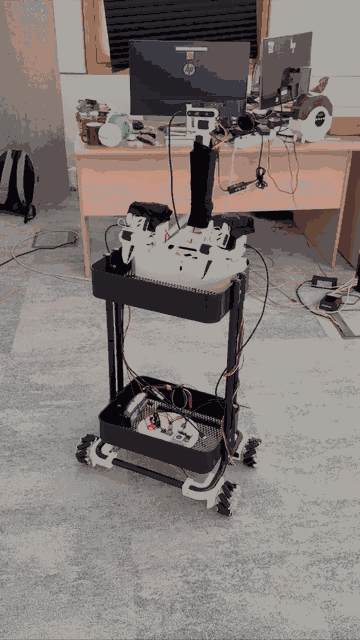

# Mecanum wheel assembly

Here briefly introduce how to build the Mecanum base version.

(This page is still under construction)

## Intro

- Use the same hardware stack as the [dual-wheel assembly](assemble_2wheel): only replace the wheels, along with their connectors.
- Mecanum drive gives holonomic motion (strafe and turn in place).
- **Four drive motors**: more total torque and traction than dual-wheel’s two motors; costs two extra motors and wiring.

More background: [GitHub issue #113](https://github.com/Vector-Wangel/XLeRobot/issues/113).

## X-pattern layout

Mount the wheels in an **X configuration**: from above, the free-spinning rollers on the four corners should line up like an **X** through the center of the base (each wheel’s rollers run toward the nearer diagonal). The `xlerobot_mecanum` software assumes this layout—the alternative **O** (diamond) pattern will not match the kinematics unless you change the model.

## Demo

The source recording was resized and frame-sampled for the docs so the file stays small in Git.

## Keyboard teleop

Use the same script as the classic XLeRobot keyboard teleop: **`software/examples/4_xlerobot_teleop_keyboard.py`**. After copying `xlerobot_mecanum` into `lerobot/robots/`, change only the imports and the host hint at the top to **`lerobot.robots.xlerobot_mecanum`** (e.g. `XLerobotConfig`, `XLerobot`, and `python -m lerobot.robots.xlerobot_mecanum.xlerobot_host`). Base keys stay **i/k/j/l/u/o** (see `teleop_keys` in `config_xlerobot.py`).

## Parts (besides 3D printed parts and servo motors)

- **Mecanum wheels** (one possible listing): [AliExpress](https://aliexpress.ru/item/1005006950038237.html?gatewayAdapt=glo2rus&sku_id=12000038827781076)
- **30 x 37 x 4 mm bearings** — same as dual-wheel
- **Longer motor cables** (or extension kit) if needed — same as dual-wheel

Printed parts for the plate and cart interface: follow the same sources as on the [dual-wheel](assemble_2wheel) page (for example [XLeRobot_0_4_0_extra.stl](https://github.com/Vector-Wangel/XLeRobot/blob/main/hardware/XLeRobot_0_4_0_extra.stl)); swap only the wheel-side parts for your Mecanum hub design.

Wheel–motor adapter (this repo): **[mecanum_wheel_motor_coupling.stl](https://github.com/Vector-Wangel/XLeRobot/blob/main/hardware/mecanum/mecanum_wheel_motor_coupling.stl)** for printing, **[mecanum_wheel_motor_coupling.step](https://github.com/Vector-Wangel/XLeRobot/blob/main/hardware/mecanum/mecanum_wheel_motor_coupling.step)** as CAD source.

## Motors

Configure Feetech IDs the same way as in the main [Assembly](assemble.md) (e.g. [Bambot Feetech tool](https://bambot.org/feetech.js)). For the default `xlerobot_mecanum` layout, the second bus carries the right arm plus **four** base motors (**7–10**: front-left, front-right, rear-left, rear-right). If your wiring differs, change the `Motor(..., id=...)` entries in `software/src/robots/xlerobot_mecanum/xlerobot.py`.
